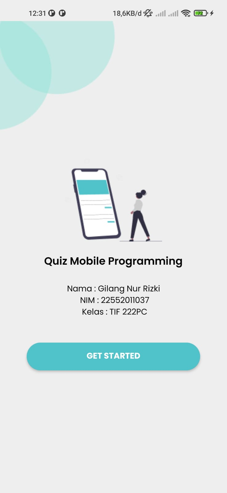
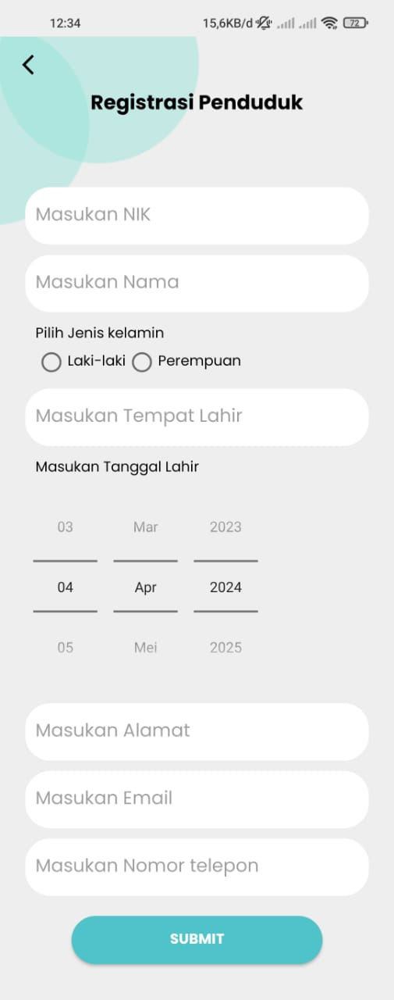

# Pendaftaran Penduduk

Sebuah aplikasi sederhana untuk pendaftaran penduduk menggunakan bahasa Java di Android Studio.

## Fitur Aplikasi

- **Registrasi Penduduk:** Memungkinkan pengguna untuk mendaftarkan diri sebagai penduduk dengan mengisi informasi dasar seperti NIK, nama, tempat dan tanggal lahir, alamat, email, dan nomor telepon.
- **Detail Penduduk:** Menampilkan detail lengkap dari penduduk yang terdaftar, termasuk informasi yang diinputkan pada saat registrasi.

## Tangkapan Layar





## Persyaratan Prasyarat

- Android Studio versi Iguana atau lebih tinggi.
- Perangkat Android atau emulator untuk menjalankan aplikasi.

## Instalasi & Penggunaan

1. Clone repositori ini ke komputer Anda:
   ```bash
   git clone https://github.com/gilangnr/aplikasi_penduduk.git
2. Buka proyek menggunakan Android Studio.
3. Jalankan aplikasi di emulator atau perangkat Android Anda.
